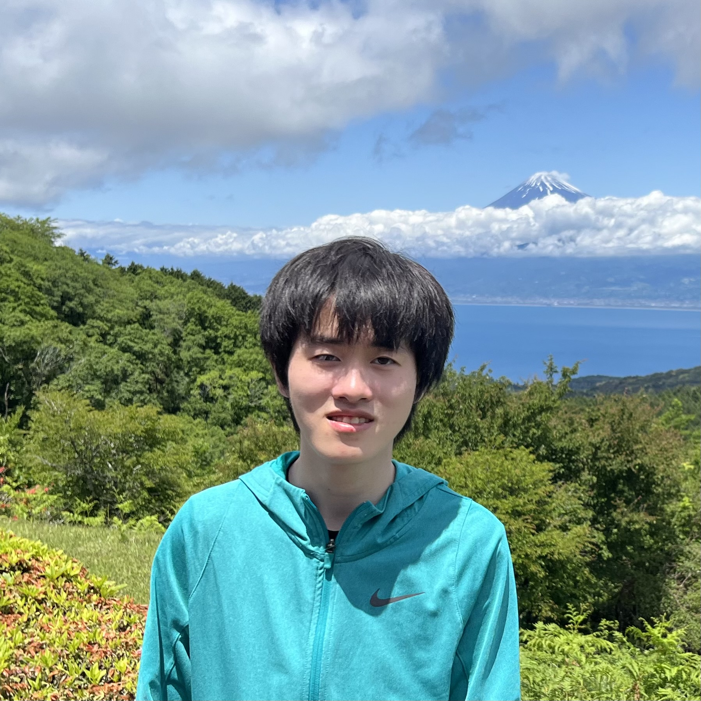

@import "https://cdn.jsdelivr.net/npm/bootstrap@5.3.3/dist/css/bootstrap.min.css"
@import "https://cdn.jsdelivr.net/npm/bootstrap@5.3.3/dist/js/bootstrap.bundle.min.js"
@import "acad.css"
@import "acad.js"

# Ruixuan Tu

  

University of Wisconsin--Madison
ruixuan@cs.wisc.edu

[[GitHub](https://github.com/TURX)] [[Google Scholar](https://scholar.google.com/citations?user=V6hzHoQAAAAJ)]

## About Me

My name is Ruixuan Tu (zh_CN: 涂 睿轩, ja_JP: トゥ・ルイシュェン). I am a fourth year undergraduate majoring in Computer Sciences (Honors), Mathematics (Honors), Data Science, Statistics, and Japanese at the [University of Wisconsin--Madison](https://www.wisc.edu) (UW--Madison). I expect to graduate in May 2025 and am seeking Ph.D. opportunities in natural language processing (NLP) and large language models (LLMs).

I am fortunate to be advised by Prof. [Forrest Sheng Bao](https://forrestbao.github.io/) @ Iowa State CS and (ML Head @) Vectara Inc, Prof. [Ramya Korlakai Vineyak](https://ramyakv.github.io/) @ UW--Madison ECE & CS & Stat, and Prof. [Junjie Hu](https://junjiehu.github.io/) @ UW--Madison BMI & CS. I have previously worked with Prof. [Jerry Zhu](https://pages.cs.wisc.edu/~jerryzhu/) @ UW--Madison CS.

## Research Interests

**Human-aligned LLMs:** Although LLMs have archived great improvements after 2018 and gained popularity among humans, it does not mean they always perform as good as humans, once we consider issues such as hallucination, bias, and factually incorrectness. I have been working on multiple projects to align LLMs with human expectations and behaviors, including:
- Evaluation of Summary: [[EMNLP'23](https://aclanthology.org/2023.findings-emnlp.87/)]
- Generalizability of In-Context Learning for Transformer Models: (WIP) ongoing honors thesis research with Prof. [Ramya Korlakai Vineyak](https://ramyakv.github.io/) and Ph.D. student [Daiwei Chen](https://chendaiwei-99.github.io/).
- LLM Agents for Opinion Dynamics: (WIP) ongoing independent study research with Prof. [Junjie Hu](https://junjiehu.github.io/) and Dr. [Yun-Shiuan (Sean) Chuang](https://yunshiuan.github.io/).

**Multilingual NLP and Computational Linguistics**: With Japanese as one of my majors, I connects my NLP knowledge with my Japanese linguistics and classical Japanese courses. I have applied multilinguial transfer learning from modern Japanese to classical Japanese in WakaGPT, and applied computational linguistics tools to analyze the morpheme origins in Japanese literature.

## Papers

### Peer-reviewed Publications

1. **DocAsRef: An Empirical Study on Repurposing Reference-based Summary Quality Metrics as Reference-free Metrics**
Forrest Bao\*, **Ruixuan Tu**\*, Ge Luo, Yinfei Yang, Hebi Li, Minghui Qiu, Youbiao He, and Cen Chen
*Findings of the Association for Computational Linguistics: EMNLP 2023*
(Presented the paper and the poster orally at 4th NewSumm Workshop in person as co-first-author)
[[ACL Anthology](https://aclanthology.org/2023.findings-emnlp.87/)] [[PDF](https://aclanthology.org/2023.findings-emnlp.87.pdf)]
[Video](https://aclanthology.org/2023.findings-emnlp.87.mp4)

2. **A review in the core technologies of 5G: device-to-device communication, multi-access edge computing and network function virtualization**
**Ruixuan Tu**, Ruxun Xiang, Yang Xu, Yihan Mei
*International Journal of Communications, Network and System Sciences, 2019*
[[SCIRP](https://www.scirp.org/journal/paperinformation?paperid=95497)] [[PDF](https://www.scirp.org/pdf/IJCNS_2019092914040589.pdf)]

### Course Papers

1. **WakaGPT: Classical Japanese Poem Generator**
**Ruixuan Tu**
*Full mark final paper for STAT 453 (Deep Learning) @ UW--Madison, Spring 2024*
<button class="btn btn-outline-primary btn-sm" type="button" data-bs-toggle="collapse" data-bs-target="#wakagpt-abstract" aria-expanded="false" aria-controls="wakagpt-abstract">Abstract</button> [[PDF](https://direct.turx.asia/wakagpt.pdf)]

  

  &emsp; Waka is a traditional Japanese poem that is usually in a certain mora sequence format. However, generating waka is challenging for general-purpose LLMs like GPT-4 due to lack of data in classical Japanese and this kind of poetry, as well as the usual format restrictions. In this paper, we present WakaGPT, a waka composer based on Japanese GPT-2 and the base models it is fine-tuned on. By self-supervised and semi-supervised training, we are able to generate waka poems with correct grammar and format.

  

2. **Analysis of Post-Meiji Word Origins in Japanese Literature: An approach in computational linguistics**
**Ruixuan Tu**
*A-mark final paper for ASIAN 434 (Japanese Linguistics) @ UW--Madison, Fall 2023*
<button class="btn btn-outline-primary btn-sm" type="button" data-bs-toggle="collapse" data-bs-target="#morpheme-summary" aria-expanded="false" aria-controls="morpheme-summary">Summary</button> [[PDF](https://direct.turx.asia/as434_paper.pdf)] [[Slide](https://direct.turx.asia/as434_slide.pdf)]

  

  &emsp; We have analyzed the distribution of origins of morphemes on Aozora Bunko dataset over all morphemes, parts of speech, and origins. For the analysis, we have used morpheme analysis tools MeCab and Juman++ by Kyoto University, and based on UniDic data, we fine-tuned DeBERTa-v2-base-Japanese to classify the origins of morphemes into three categories: native, Sino-Japanese (SJ), and mixed. The hypothesis was that the Japanese government advocates the usage of SJ and native words before/in WWII, and western culture becomes more popular after WWII, but as a result from this analysis, we can even see some preferences toward native words, contradicting the hypothesis.

  

## Work Experience

**[Textea Inc](https://github.com/TexteaInc)**
Software Development Engineer Intern (May 2022 --- September 2022)
- Lead Developer of [Funix](https://funix.io/): NodeJS generator from Python functions to serverless web instances, helping ML researchers deploy their apps [[PyCon US 2024 Poster](https://us.pycon.org/2024/schedule/posters/list/)] [[SciPy Conference 2024](https://github.com/scipy-conference/scipy_proceedings/pull/948)]
- Lead Developer of Web Backend: APIs for user auth, permission, admin, RPC and HTTP remote call
- Developer of NLP Backend: classical natural language processing task implementation in Python, API migration

**UW--Madison**
- Peer Mentor (Undergraduate TA) of [COMP SCI 540 (Intro-Artificial Intelligence)](https://pages.cs.wisc.edu/~jphanna/teaching/2023spring_cs540/teaching_team.html): Helping students to learn machine learning, math, game, and search by answering questions during office hours (September 2022 --- May 2024)
  - Received [Golden Bricks Award (2023)](https://www.cs.wisc.edu/2023-cs-department-awards-and-thank-yous/#GOLDEN%20BRICK%20AWARDS) for excellent service to CS Department
- Tutor of Calculus @ University Housing: providing individual and group tutoring to residents taking math courses including multivariable calculus, linear algebra, and intro analysis (September 2022 --- Present)

## Awards

- Undergraduate Scholarship for Summer Study, UW--Madison, 2023 and 2024
- Silver Medal, 2021 ACM-ICPC NCNA Regional, Team THREE_PUPILS

